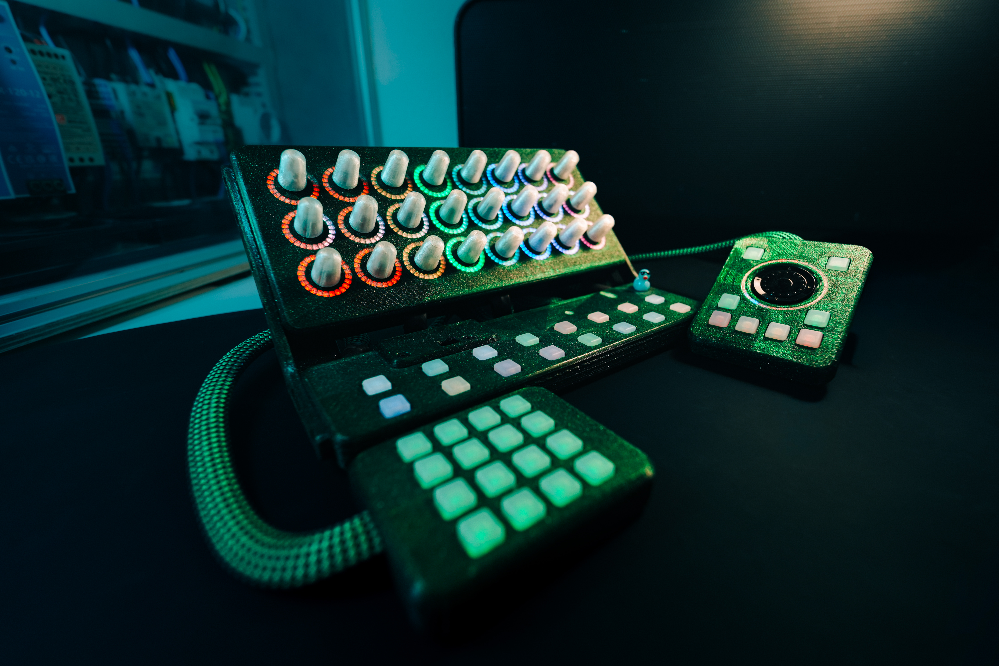
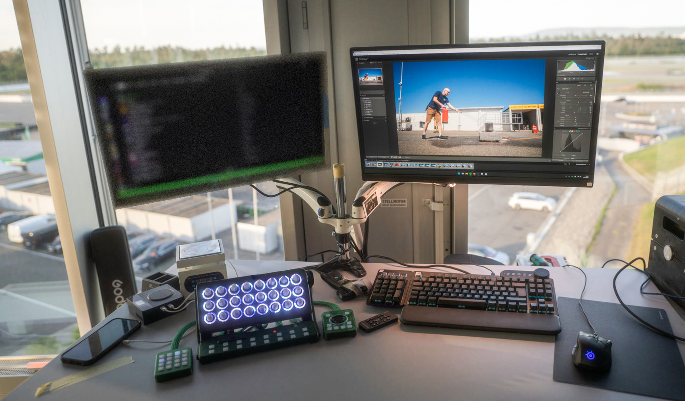
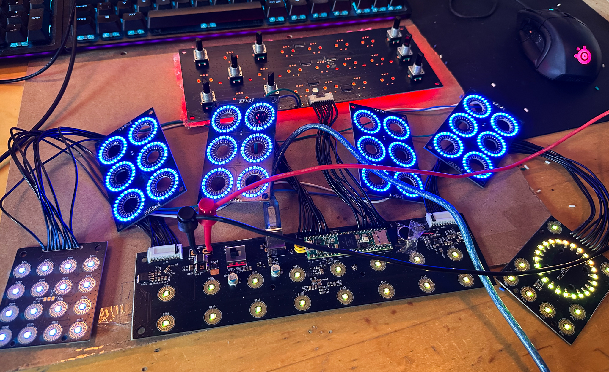
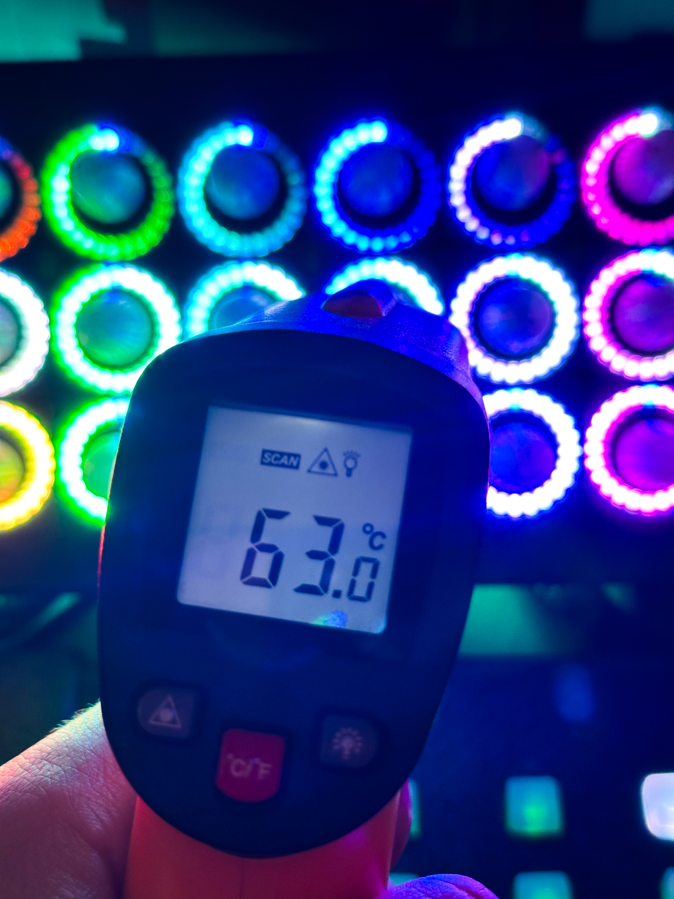

<h1 align="center"><b>LightPad</b></h1>
DIY MIDI Controller to use with the Midi2LR Plugin

<picture>

</picture>

 

# Main features
- **[24x Interrupt-Driven Encoders](https://github.com/PaulSalz/lightpad/blob/main/Media/test_enc_led.jpg)**  
     - 3x8 RGB-illuminated Push-Button Encoders for all the main sliders, Lights, HSl, Details, ColorGrading, Effects...
- **[4x4 Button Matrix](https://github.com/PaulSalz/lightpad/blob/main/Media/top_view.jpg)**  
     - 16x RGB Buttons for easy Preset, Shortcut access
- **[Main Module](https://github.com/PaulSalz/lightpad/blob/main/Media/test_all.jpg)**  
     - 2x8 Buttons for switching Layers and often used features
- **[Media/ Culling Pad](https://github.com/PaulSalz/lightpad/blob/main/Media/side_view.jpg)**  
     - 8x RGB Buttons and an ANO Directional Navigation and Scroll Wheel to cull and navigate your library
- **[Force Feedback](https://github.com/PaulSalz/lightpad/blob/main/Media/test_all.jpg)**  
     - Integrated ERM Motor with DRV2605L for easy haptic effects 
- **[IR Remote Control](https://github.com/PaulSalz/lightpad/blob/main/Media/test_all.jpg)**  
     - Sometimes stepping back and cull from a distance helps me with culling
- **[Easy to print dual color case](https://www.rosa3d.pl/)**  
    - all printed from Rosa3D-Filaments PETG 
- **[Low/ High power mode](https://github.com/PaulSalz/lightpad/blob/main/Hardware/LightPad_BOM.html)**  
    - Full brightness gets unlocked with a external 5V source, and a mechanical switch on the main controller to prevent brown outs
- **[Animations]()**  
    - Idle animation
    - Button/ Encoder Effects
    - Backside illumination
- **[EL-Facts](https://github.com/PaulSalz/lightpad/blob/main/Media/usecase.jpg)**
    - Teensy 4.1 based
    - resettable fuses for both power inputs
    - RT1985N-A Protection IC for Softstart (needs some work)
    - I²C Level Shift 
    - Dual 74HC2G34 Buffer Gate for the LED's (using DMA)
    - expansion header for a Touch SPI Screen
    - all inputs connected through MCP23017 I/O expanders
  
 

     
<picture>

</picture>
<picture>

</picture>
     

 

## TO-DO
  - fix all the bugs that occurred during assembly
  - rewrite the code so everything can be configured on the fly without reflashing
  - ...

## Background
- In the past I used a Behringer X-Touch mini for editing with Lightroom Classic and although this worked somewhat great enough to convince colleagues to also get one I wanted more, having to constantly switch layers, modes and remembering all of them to find the right settings annoyed me and gave me the motivation for this. 
  There are other great options out there but I wanted something without proprietary software that maybe gets bricked in the future. and i wanted something fancy, something completly over the top, do you need that many LED's? hell no..  But they definitely help a lot with remembering all the functions and look awesome.

## Disclaimer
- This is a first try on a DIY Midi controller that was created roughly in a span of a month from idea to actually getting used.  
- There will be and there are bugs, for example part of the pcb's need a bit of rework and changes to work out of the box.

 

     
<picture>

</picture>
<picture>

</picture>
     

 

