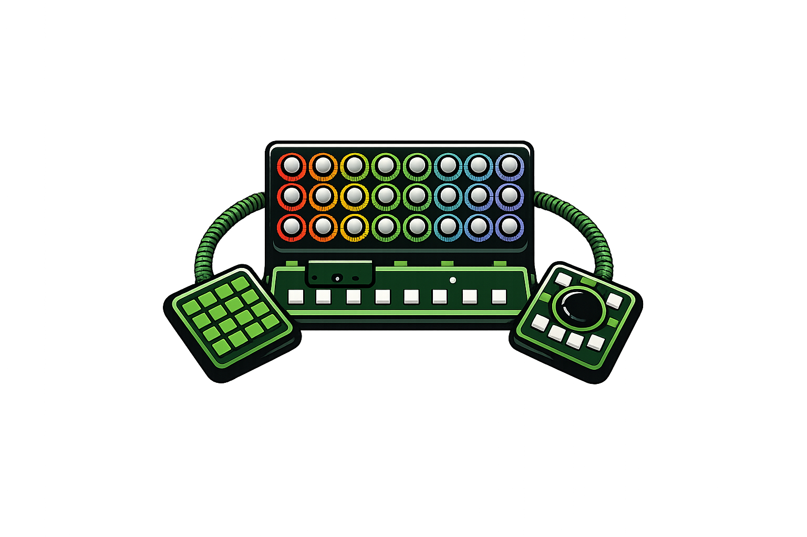

<picture>
  
</picture>

LightPad: my trusty DIY Midi Controller for Lightroom picture editing
<h3>

 

# Main features

- **[24 Encoders]()**  
  24- RGB Illuminated Push-Button Encoders for fine adjustments
- **[4x4 Button Pad]()**  
  ...
- **[Media Pad]()**  
  ...  
- **[Force Feedback]()**  
  ...  
- **[IR Remote Control]()**  
  ...  
- **[Easy to print dual color case]()**  
  ...    
- **[Low/ High power mode]()**  
  ...  
- **[External Power]()**  
  ...  

 

## Some background

LightPad 
Hello World!

 

